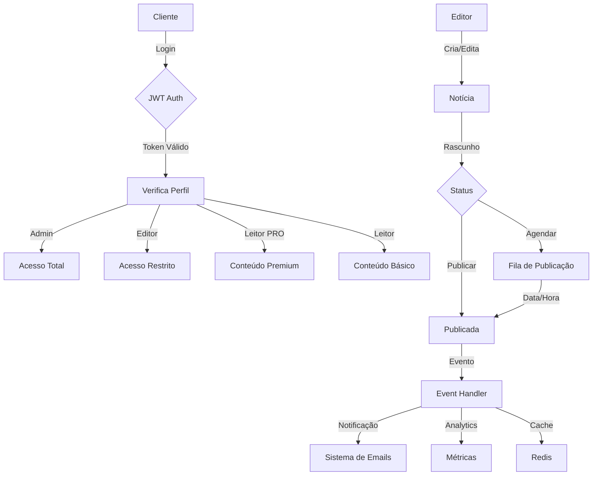

# JOTA API

API do JOTA para gerenciamento de notícias e conteúdo.

## Fluxograma do Sistema



## Arquitetura

A API foi estruturada seguindo princípios SOLID e padrões de design modernos:

- **Camada de Serviços**: Encapsula toda a lógica de negócios
- **Validação Robusta**: Validações completas em todas as operações
- **Cache**: Sistema de cache otimizado para melhor performance
- **Permissões Granulares**: Controle de acesso preciso por tipo de usuário

## Estrutura do Projeto

```
JOTA/
├── user/                     # App de autenticação e usuários
│   ├── views/
│   │   └── auth_views.py    # Views de autenticação
│   ├── services.py          # Lógica de negócios de usuários
│   └── permissions.py       # Classes de permissão
│
└── editor/                  # App de notícias e conteúdo
    ├── views/
    │   ├── news_views.py    # Views de notícias
    │   └── analytics_views.py# Views de análises
    ├── services.py          # Lógica de negócios de notícias
    └── permissions.py       # Classes de permissão
```

## Configuração do Ambiente

1. Clone o repositório
2. Crie um ambiente virtual: `python -m venv venv`
3. Ative o ambiente virtual: 
   - Windows: `venv\Scripts\activate`
   - Linux/Mac: `source venv/bin/activate`
4. Instale as dependências: `pip install -r requirements.txt`
5. Configure as variáveis de ambiente (copie `.env.exemple` para `.env`) ou utilize o comando 
`cp .env.exemple .env`
6. ativação do docker-compose `docker-compose up -d`
7. Execute as migrações: `python manage.py migrate`
8. Crie um superusuário: `python manage.py createsuperuser`
9. Execute o servidor: `python manage.py runserver`

## Endpoints da API

### Autenticação (`/api/v1/auth/`)

- `POST /auth/register/` - Registro de novo usuário
  - Validação robusta de senha e dados
  - Criação automática de perfil
  - Retorno de token JWT para autores autorizados

- `POST /auth/login/` - Login (JWT)
- `POST /auth/refresh/` - Atualizar token JWT

### Notícias (`/api/v1/news/`)

- `GET /news/` - Listar notícias
  - Suporta paginação (`?page=1`)
  - Filtros: categoria, status, acesso, data
  - Busca: título, conteúdo, categoria
  - Ordenação: data_de_publicacao, data_de_criacao, titulo

- `POST /news/` - Criar nova notícia (requer autenticação)
  - Validação completa dos dados
  - Upload de imagens
  - Atribuição automática do autor

- `GET /news/{id}/` - Detalhes da notícia
  - Cache otimizado
  - Rastreamento de visualizações

- `PUT /news/{id}/update/` - Atualizar notícia
  - Validação de permissões
  - Atualização parcial suportada
  
- `DELETE /news/{id}/` - Excluir notícia
  - Validação de permissões
  - Limpeza automática de cache

### Análises (`/api/v1/analytics/`)

- `GET /analytics/news/` - Métricas de notícias
  - Estatísticas gerais
  - Tendências de publicação
  - Top notícias por visualização
  - Distribuição por categoria/acesso
  - Cache otimizado (5 min)

- `GET /analytics/authors/` - Métricas por autor
  - Estatísticas de produção
  - Métricas de produtividade
  - Análise temporal
  - Cache otimizado (15 min)

## Níveis de Acesso

### Admin
- Acesso total a todas as funcionalidades
- Pode gerenciar todos os usuários e conteúdos
- Acesso a todas as métricas e análises

### Editor
- Gerencia suas próprias notícias
- Acesso às métricas de suas notícias
- Não pode gerenciar outros usuários

### Usuário PRO
- Acesso a conteúdo premium de suas categorias
- Visualização otimizada com cache
- Não pode criar ou editar conteúdo

### Usuário Comum
- Acesso apenas a conteúdo público
- Cache para melhor performance
- Não pode criar ou editar conteúdo

## Segurança

- Validação robusta de senhas:
  - Mínimo 8 caracteres
  - Letras maiúsculas e minúsculas
  - Números
  
- Proteção contra ataques comuns
- Rate limiting
- Sanitização de dados

## Cache

- Cache em múltiplos níveis:
  - Listagens de notícias (15 min)
  - Análises gerais (5 min)
  - Análises por autor (15 min)
  - Métricas de visualização (5 min)


## Testes

Execute os testes automatizados:
```bash
python manage.py test
```

## Performance

- Sistema de cache em múltiplas camadas
- Paginação otimizada
- Queries otimizadas
- Monitoramento de performance via analytics

## Linting do Código

Este projeto utiliza o `flake8` para garantir a qualidade do código e aderência às boas práticas de estilo.

### Instalação do `flake8`

Certifique-se de que o `flake8` está instalado no ambiente virtual. Ele já está listado no arquivo `requirements.txt`. Para instalar:

```bash
pip install -r [requirements.txt](http://_vscodecontentref_/6)
```
